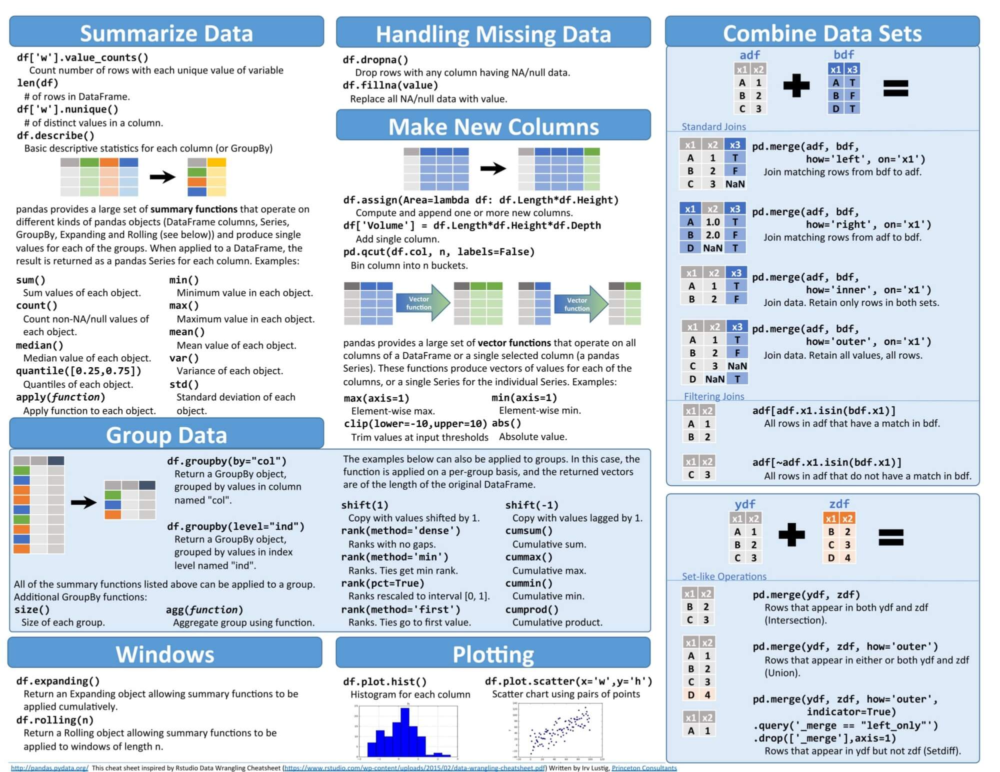

# Cheat-sheet
Machine learning base on python cheat sheet.
# Python basic

# Linear algebra

# Numpy

# Pandas

# Scipy

# DataFrame

# Matplotlib

# Scikit-Learn

# Deep-learning

# Keras

# Data structure

